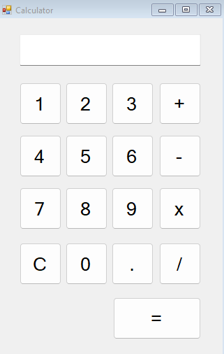

# C++ Calculator Desktop App


## Description
This is a simple calculator application built using **C++** and **C++/CLI** with a graphical user interface (GUI). The application was developed in **Visual Studio** and allows users to perform basic arithmetic operations such as addition, subtraction, multiplication, and division. The app features a clean and easy-to-use interface for users to input values and perform calculations.

## Features
- **Basic Arithmetic Operations**: Supports addition, subtraction, multiplication, and division.
- **User Interface**: A GUI built with C++/CLI and Windows Forms for an intuitive user experience.
- **Display Area**: Displays the current input and result of the calculation.
- **Buttons**: Buttons for numbers (0-9, arithmetic operators (+, -, *, /), decimal point (.) and cleaner (C).

  

## Requirements
- **Visual Studio**: Ensure that you have Visual Studio installed with support for C++ and Windows Forms (C++/CLI).
- **C++/CLI**: The application uses C++/CLI to integrate managed .NET Framework features with C++ code.
- **Windows OS**: The application is intended for use on Windows systems due to its reliance on Windows Forms.

## Getting Started

### Prerequisites
- **Visual Studio** (version 2017 or later recommended)
- **C++/CLI Support** enabled in Visual Studio (this is required for working with Windows Forms in C++).

### Installation
1. Clone this repository to your local machine:
    ```bash
    git clone https://github.com/rosa-lpz/Cpp_Calculator-App.git
    ```
2. Open the project in **Visual Studio**:
   - Navigate to the `cpp-calculator` folder and open the `.sln` file.
3. Build the project:
   - In Visual Studio, press **Ctrl + Shift + B** or go to **Build > Build Solution** to compile the project.
4. Run the project:
   - After building, press **F5** to run the calculator application.

### Usage
- The calculator window will open with buttons representing digits (0-9) and basic arithmetic operations (+, -, *, /).
- Click the buttons to input numbers and operations. The result will appear in the display area.
- The calculator supports basic arithmetic, and users can continue inputting numbers and operators for multiple calculations.
